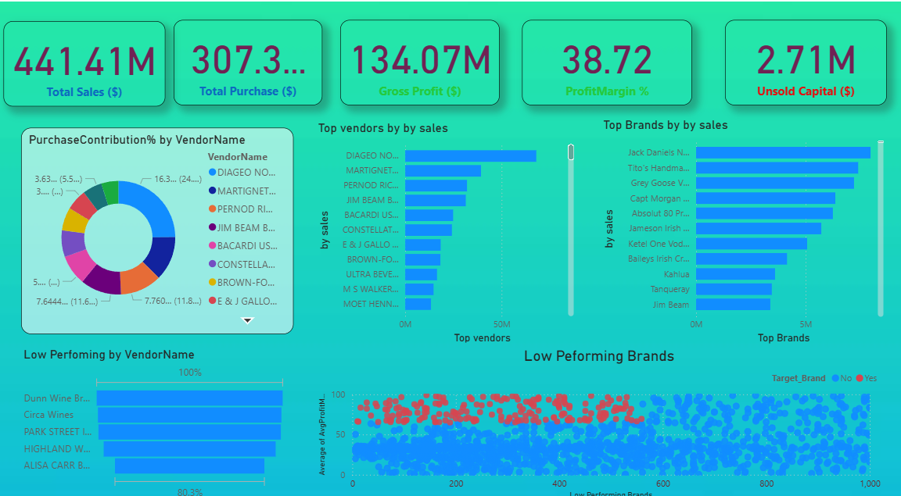

# Vendor Performance Analysis- Retial Inventory & Sales

Analyzing vendor efficiency and profitablity to support purchasing and inventory decisions using SQL, Python, and Poewer BI.

# Table of Contents
#### Overview
#### Business Probelm 
#### Dataset 
#### Tools and Technologies
#### Project Structure
#### Data Cleaning & Preparation
#### Exploratory Data Analysis (EDA)
#### Research Questions Key Findings
#### Dashboard
#### Final Recommendatoin

# Overall
#### This project evaluates vendor performance and retial inventory dynamics to drive strategic insights for purchasing, pricing, and inventory optimization. Acomplete data pipeline was built using SQL for ETL, Python for analysis and hypothesis testing, and Power BI for visualization

# Business Problem

#### Effective inventory and sales management are critical in the retail sector. This projects aims to:
#### Identify underperforming brands needing pricing or promotional adjustments
#### Determine vendor contributions to sales and profit.
#### Analyze the cost-benefit of bulk purchasing
#### Investigate inventory turnover inefficiencies 
#### Statistically validate differences in vendor profitiability

# Dataset
#### Multiple csv files located in /data/ folder (sales, vendors, inventory)
#### SUmmary tables created from ingested data and used for analysis

# Tools & Technologies
#### SQL ( Common Table Expressions, Joins, Filtering)
#### Python(Pandas,Matplotlib,Seaborn, SciPy)
#### Power BI (Dashboard)

# Data Cleaning & Preparation

### Removed transactions with:
  #### Gross Profit <= 0
  #### Profit Margin<= 0
  #### Sales Quantity =0
#### Created summary tables with vendor-level metrics
#### Converted data types, handled outliers, merged lookup tables

# Exploratory Data Analysis (EDA)

### Negative or Zero Values Detected:
  #### Gross Profit: Min -52,0002 (loss-making sales)
  #### Unsold Inventory: Indicating slow-moving stock

### Outliers Identified
  #### High Freight Costs (up to 257)

  #### Large Purchase/Actual Price

### Correlation Analysis
  #### Weak between Purchase Price and  Profit
  #### Strong between Purchase Quantity and Sales Quantity 
  #### Negative between Profit Margin & Slaes Price 
# Research Questions & Key Findings

#### 1. Brands for Promotinos: 198 brands with low sales but high profit margins
#### 2. Top Vendors: Top 10 vendors= 66% of purchsases---risk of over-reliance
#### 3. Bulk Purchasing Impact: 72% cost savings per unit in large orders
#### 4. Inventory Turnover: $2.71M worth of unsold inventory

#### 5. Vendor Profitability:
 #### High Vendors: mean Margin=32%
 #### Low Vendors: Mean Margin =41.55% 
#### 6. Hypothesis Testing: Statistically significant diffence in profit margins--- distinct vendor strategies 

# Dashboard

##### Power BI Dashboard Shows:
 #### Vendor- wise Sales and Margins
 #### Inventory Turnover
 #### Bulk Purchase Savings

 

 # Final Recommendation
 #### DIversify vendor base to reduce risk
 #### Optimize buil order strategies 
 #### Reprice slow-moving, high-margin brands
 #### Reprice slow-moving, high-margin brands
 #### Clear unsold inventory strategically
 #### Improve marketing for underperforming vendors
 